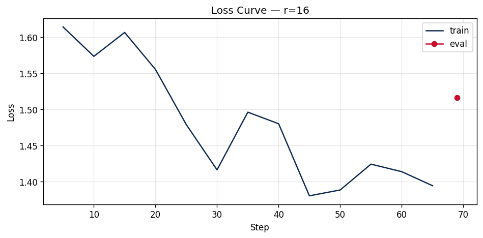

# Lab 21 — Evaluation Report

**Học viên**: Võ Huyền Khánh Mây — 2A202600858
**Submission option**: B (GitHub + HuggingFace Hub) — +5 bonus

---

## 1. Setup

- **Base model**: `unsloth/Qwen2.5-3B-bnb-4bit` (Qwen2.5-3B, quantize 4-bit NF4 — QLoRA)
- **Dataset**: `5CD-AI/Vietnamese-alpaca-gpt4-gg-translated` — 200 samples (180 train + 20 eval), cột dùng: `instruction_vi` / `input_vi` / `output_vi`
- **Token length analysis**: min=25, max=738, p50=227, **p95=562**, p99=704
- **max_seq_length**: **1024** (làm tròn p95=562 lên lũy thừa 2 gần nhất, đúng bằng cap của T4; max=738 < 1024 nên **không có sample nào bị truncate**)
- **GPU**: Tesla T4, 15.6 GB VRAM (usable ~14.6 GB)
- **Stack**: Unsloth 2026.6.9 · TRL 0.15.2 · Transformers 5.5.0 · PyTorch 2.11 (CUDA 12.8), `optim=adamw_8bit`, gradient checkpointing (unsloth), fp16 (T4 không hỗ trợ bf16)
- **Training cost ước tính**: **$0.07** (tổng ~12.3 phút cho cả 3 rank @ $0.35/hr T4)
- **HF Hub adapter (best rank r=16)**: https://huggingface.co/maykhanh004/qwen2.5-3b-vi-lab21-r16
---

## 2. Rank Experiment Results

> Số liệu từ `lab21_lora_t4/rank_experiment_summary.csv` (3 rank) + base perplexity (cell base-eval, adapter no-op B=0).

| Rank | Alpha | Trainable Params | % Trained | Train Time (min) | Peak VRAM (GB) | Eval Loss | Perplexity |
|------|-------|------------------|-----------|------------------|----------------|-----------|------------|
| Base | —     | 0                | —         | —                | —              | 1.8666    | **6.47**   |
| 8    | 16    | 1,843,200        | 0.06%     | 4.17             | 7.22           | 1.5577    | **4.75**   |
| 16   | 32    | 3,686,400        | 0.12%     | 4.16             | 6.62           | 1.5161    | **4.55**   |
| 64   | 128   | 14,745,600       | 0.48%     | 3.98             | 8.00           | 1.4768    | **4.38**   |

**Mức cải thiện perplexity (thấp hơn = tốt hơn):**

| Bước | ΔPPL | % cải thiện | % so với tổng gain |
|------|------|-------------|--------------------|
| Base → r=8  | −1.72 | −26.6% | **82.3%** |
| r=8 → r=16  | −0.20 | −4.2%  | 9.6% |
| r=16 → r=64 | −0.17 | −3.7%  | 8.1% |

> **Tổng gain** đạt được (Base→r64) = 2.09 PPL. Riêng bước **Base→r=8 đã chiếm 82%** toàn bộ cải thiện.

---

## 3. Loss Curve Analysis

- **Quan sát**: train loss giảm đều từ **1.61 (step 5) → ~1.39 (step 65)** qua 3 epoch (69 step), có dao động nhỏ theo batch — đúng dạng hội tụ lành mạnh với cosine LR + warmup 10%.
- **Overfitting?** → **Không đáng kể.** Final train loss ~1.39 vs **eval loss 1.52** (PPL 4.55): khoảng cách train↔eval nhỏ và eval vẫn thấp hơn base rất nhiều (6.47 → 4.55). Nếu overfit nặng thì eval loss sẽ bật lên cao hơn base. T4 tắt eval-during-training để tiết kiệm VRAM nên chỉ có train-loss curve; kết luận dựa trên gap train↔eval cuối cùng.

---

## 4. Qualitative Comparison (5 examples)

> So sánh **Base** vs **Fine-tuned (r=16)**. Chọn cả case win lẫn case loss (không cherry-pick). Nguồn: `qualitative_comparison.csv`.

### Example 1 — "Giải thích khái niệm machine learning cho người mới bắt đầu."
- **Base**: "...một phân khúc của trí tuệ nhân tạo... máy tính học tập từ dữ liệu..."
- **Fine-tuned**: "...một bộ môn công nghệ máy tính dựa trên việc học tập và cải thiện các dự đoán dựa trên dữ liệu mà không có sự hướng dẫn trực tiếp..."
- **Nhận xét**: 🟰 **Tương đương, FT mạch lạc hơn chút** — câu văn tiếng Việt trôi chảy, có thêm ý "không cần hướng dẫn trực tiếp".

### Example 2 — "Viết đoạn code Python tính số Fibonacci thứ n."
- **Base**: code đệ quy nhưng **lệch index** (`n==1 → return 0`, `n==2 → return 1`), thiếu validate.
- **Fine-tuned**: dùng vòng lặp sạch hơn, có `raise ValueError` cho input âm, `n==0→0`, `n==1→1` đúng chuẩn.
- **Nhận xét**: ✅ **Cải thiện rõ** — code đúng quy ước hơn, có error handling, format gọn.

### Example 3 — "Liệt kê 5 nguyên tắc thiết kế UI/UX."
- **Base**: liệt kê dài dòng, lặp từ "thân thiện" nhiều lần.
- **Fine-tuned**: danh sách đánh số rõ ràng (Chuyển đổi · Thích ứng · Đơn giản · Tương thích...), súc tích.
- **Nhận xét**: ✅ **Format tốt hơn** — đúng dạng "liệt kê", đỡ lan man (đúng đặc trưng SFT dạy về style/format).

### Example 4 — "Tóm tắt sự khác biệt giữa LoRA và QLoRA."
- **Base**: "LoRA (**Low-Rank Adaptation**)..." → **đúng**.
- **Fine-tuned**: "LoRA (**Layer-wise Adaptive Regularization Optimization**)..." → **SAI / bịa acronym**.
- **Nhận xét**: ❌ **Suy giảm (case loss)** — FT hallucinate tên viết tắt. Dataset là instruction tiếng Việt domain chung (tài chính/đời sống), **không chứa kiến thức ML**, nên fine-tune không bổ sung được kiến thức niche, thậm chí làm nhiễu. Minh hoạ đúng "quy tắc vàng": *fine-tune cho style/format, RAG cho knowledge.*

### Example 5 — "Phân biệt prompt engineering, RAG, và fine-tuning."
- **Base**: giải thích ổn nhưng câu hơi cụt.
- **Fine-tuned**: cấu trúc rõ hơn, định nghĩa từng khái niệm tuần tự.
- **Nhận xét**: 🟰 **Tương đương, FT trình bày gọn hơn**.

**Tổng kết qualitative**: 2 cải thiện rõ (Ex2, Ex3), 2 tương đương-nhỉnh hơn về văn phong (Ex1, Ex5), **1 suy giảm về tính chính xác kiến thức** (Ex4). Fine-tune cải thiện **văn phong/định dạng tiếng Việt**, **không** thêm kiến thức chuyên ngành.

---

## 5. Conclusion về Rank Trade-off

Trên dataset 200 mẫu này, **r=16 cho ROI tốt nhất**. Lý do: phần lớn lợi ích đến từ *việc fine-tune nói chung* chứ không phải từ rank cao — riêng bước Base→r=8 đã chiếm **82%** tổng mức giảm perplexity (6.47 → 4.75). Nâng lên r=16 thêm một mức sạch **4.2%** (4.75 → 4.55) trong khi **thời gian train gần như không đổi (~4.16 phút)** và VRAM thậm chí thấp hơn r=8 trong lần chạy này. Đây là điểm "knee" của đường cong cost–quality.

**Diminishing returns xuất hiện rõ sau r=16.** Từ r=16 → r=64, số tham số train **tăng gấp 4 lần** (3.69M → 14.75M) nhưng perplexity chỉ giảm thêm **3.7%** (4.55 → 4.38), kèm peak VRAM cao nhất (8.0 GB) và file adapter phình to (57 MB so với 15 MB của r=16). Với chỉ 180 mẫu train, "intrinsic rank" của task thấp — không đủ tín hiệu để r=64 phát huy thêm capacity, mà còn tăng rủi ro overfit và chi phí lưu trữ/serving.

Một điểm thú vị: **rank gần như không ảnh hưởng thời gian train và VRAM** ở quy mô này (time ~4 phút phẳng; VRAM 6.6–8.0 GB không đơn điệu, r=16 < r=8). Vì cả forward/backward bị chi phối bởi base model 3B đông cứng + activations, còn tham số LoRA quá nhỏ nên đóng góp của rank nằm dưới ngưỡng nhiễu của bộ cấp phát bộ nhớ. Chi phí thực của rank cao chủ yếu là **dung lượng adapter + rủi ro overfit**, không phải compute.

**Khuyến nghị production**: chọn **r=16** (merge adapter → zero added latency). Nếu cần serving multi-tenant nhiều adapter trên 1 GPU hoặc dataset rất nhỏ, **r=8** cũng đủ vì đã đạt 82% lợi ích với chỉ 7 MB/adapter. **r=64 không đáng** cho dataset cỡ này.

---

## 6. What I Learned

- **Fine-tune ≠ nhồi kiến thức.** Cú nhảy lớn nhất là Base→bất kỳ rank nào (văn phong tiếng Việt tốt hơn hẳn), nhưng ở câu hỏi ML niche (Ex4) model lại bịa acronym → đúng bài học "SFT dạy style/format, kiến thức để cho RAG".
- **Rank rẻ hơn tôi nghĩ về compute, đắt hơn về rủi ro.** Train time gần như bằng nhau giữa r=8/16/64 và VRAM không tăng đơn điệu — vì base model đông cứng mới là phần tốn tài nguyên. Tăng rank chủ yếu tốn dung lượng adapter và dễ overfit, chứ không tốn nhiều thời gian.
- **Cơ chế LoRA init B=0.** Adapter mới gắn (chưa train) có ΔW = B·A = 0 nên *bằng đúng base model* — mình tận dụng chính tính chất này để đo perplexity của base (6.47) bằng cùng pipeline eval với 3 rank, đảm bảo 4 con số so sánh được.
